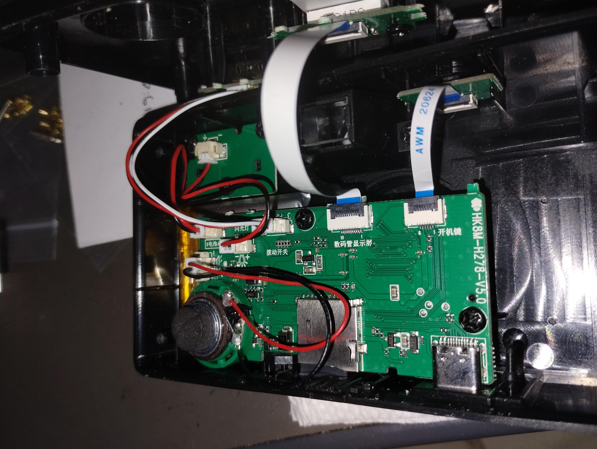
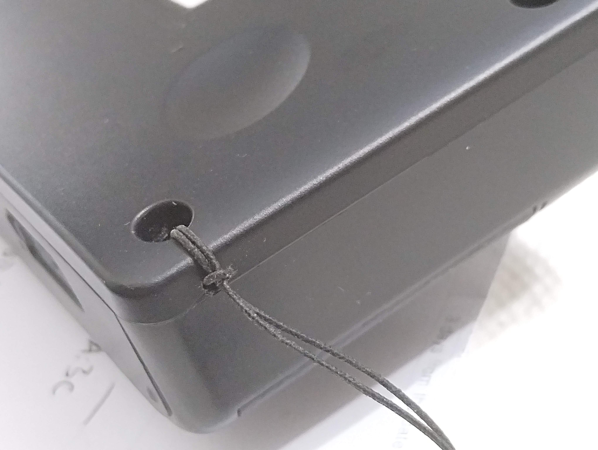

# campsnap-fun

## random info on the camp snap camera
* device comes with an unbranded 4GB microsdhc card, class 10, made in Taiwan.
  * filesystem label is "CAMPSNAP"
* works as a usb webcam when no microsd card is inserted
  * available resolutions: 640x480, 320x240, and 160x120. 1280x720 didn't work though it was listed
* there is some sort of an RTC as it keeps time when off, but there seems to be no obvious way to set the clock
  * resets to 12/31/2022 16:00:00 upon firmware reflash. at one point it reset to 01/01/2010 04:00:00, probably after disconnecting battery?
* the idle poweroff timer seems to be 10 minutes \[and ~3-4 seconds\]

### operation
* make sure camera battery is not dead
* hold down shutter button
* display shows `---`. keep holding the button!
* device beeps after ~2.5 seconds and you can let go of the button
* wait another ~3 seconds for device to finish booting and scan the microsd card (for 148 photos in my case)
* display shows the amount of photos taken
* ready to take photos! press and release shutter button. hold still!
* display shows `---`
* wait ~0.8 seconds until shutter sound plays, indicating the photo has been taken
* wait another ~2.5 seconds for it to save photo
* display shows amount of photos taken
#### tips
* go to [time.is](https://time.is) on a phone/tablet/desktop and take a photo. then when reviewing your photos you have a date/time reference to adjust the timestamps if needed.
* have the camera pointed at your subject for a second or two before taking a photo. the auto exposure is always working in the background until the shutter button is pressed.
  * you can get creative with this by pointing it at a brighter/darker area before taking a photo of your subject to underexpose/overexpose the photo, but you'll have to be quick.
  * the camera doesn't seem to compensate for exposure when flash is enabled

### dmesg with stock microsd card
```
[0.120121] usb 5-1.1.3: new high-speed USB device number 78 using xhci_hcd
[0.272862] usb 5-1.1.3: New USB device found, idVendor=04fc, idProduct=1628, bcdDevice= 1.00
[0.272874] usb 5-1.1.3: New USB device strings: Mfr=1, Product=2, SerialNumber=0
[0.272880] usb 5-1.1.3: Product: General Image Device
[0.272885] usb 5-1.1.3: Manufacturer: Icatchtek Co Ltd 
[0.342199] usb 5-1.1.3: Found UVC 1.00 device General Image Device (04fc:1628)
[1.433795] usb 5-1.1.3: Failed to query (GET_INFO) UVC control 2 on unit 2: -71 (exp. 1).
[1.434138] usb 5-1.1.3: Failed to query (GET_INFO) UVC control 3 on unit 2: -71 (exp. 1).
[1.434518] usb 5-1.1.3: Failed to query (GET_INFO) UVC control 6 on unit 2: -71 (exp. 1).
[1.434873] usb 5-1.1.3: Failed to query (GET_INFO) UVC control 7 on unit 2: -71 (exp. 1).
[1.435241] usb 5-1.1.3: Failed to query (GET_INFO) UVC control 8 on unit 2: -71 (exp. 1).
[1.435616] usb 5-1.1.3: Failed to query (GET_INFO) UVC control 5 on unit 2: -71 (exp. 1).
[1.492286] usb 5-1.1.3: UVC non compliance - GET_DEF(PROBE) not supported. Enabling workaround.
[1.492656] uvcvideo 5-1.1.3:1.1: Failed to query (129) UVC probe control : -71 (exp. 26).
[1.492667] uvcvideo 5-1.1.3:1.1: Failed to initialize the device (-71).
[1.927458] usb 5-1.1.3: USB disconnect, device number 78
[2.197245] usb 5-1.1.3: new high-speed USB device number 79 using xhci_hcd
[2.345415] usb 5-1.1.3: New USB device found, idVendor=04fc, idProduct=0171, bcdDevice= 1.00
[2.345420] usb 5-1.1.3: New USB device strings: Mfr=1, Product=2, SerialNumber=3
[2.345422] usb 5-1.1.3: Product: General Image Device
[2.345423] usb 5-1.1.3: Manufacturer: Icatchtek Co Ltd 
[2.345425] usb 5-1.1.3: SerialNumber: 20100805 01.00
[2.388158] usb-storage 5-1.1.3:1.0: USB Mass Storage device detected
[2.388576] scsi host2: usb-storage 5-1.1.3:1.0
[3.411916] scsi 2:0:0:0: Direct-Access                General             PQ: 0 ANSI: 0 CCS
[3.414182] sd 2:0:0:0: [sdb] 7864320 512-byte logical blocks: (4.03 GB/3.75 GiB)
[3.415451] sd 2:0:0:0: [sdb] Write Protect is off
[3.415454] sd 2:0:0:0: [sdb] Mode Sense: 20 00 00 00
[3.416721] sd 2:0:0:0: [sdb] No Caching mode page found
[3.416724] sd 2:0:0:0: [sdb] Assuming drive cache: write through
[3.426180]  sdb: sdb1
[3.427153] sd 2:0:0:0: [sdb] Attached SCSI removable disk
```

### internal photo
* 
* more photos coming soon!

### sample image exif data
`exiv2 -pe SUNP0001.JPG`
| key | type | len | value |
|-|-|-|-|
| Exif.Image.Make | Ascii | 12 | Icatch |
| Exif.Image.Model | Ascii | 10 | Spca1628 |
| Exif.Image.Orientation | Short | 1 | 1 |
| Exif.Image.XResolution | Rational | 1 | 72/1 |
| Exif.Image.YResolution | Rational | 1 | 72/1 |
| Exif.Image.ResolutionUnit | Short | 1 | 2 |
| Exif.Image.Software | Ascii | 12 | V233-00-01 |
| Exif.Image.DateTime | Ascii | 20 | 2023:01:25 17:23:05 |
| Exif.Image.YCbCrPositioning | Short | 1 | 2 |
| Exif.Image.ExifTag | Long | 1 | 216 |
| Exif.Photo.ExposureTime | Rational | 1 | 10/332 |
| Exif.Photo.FNumber | Rational | 1 | 32/10 |
| Exif.Photo.ExposureProgram | Short | 1 | 2 |
| Exif.Photo.ISOSpeedRatings | Short | 1 | 800 |
| Exif.Photo.ExifVersion | Undefined | 4 | 48 50 50 48 |
| Exif.Photo.DateTimeOriginal | Ascii | 20 | 2023:01:25 17:23:05 |
| Exif.Photo.DateTimeDigitized | Ascii | 20 | 2023:01:25 17:23:05 |
| Exif.Photo.ComponentsConfiguration | Undefined | 4 | 1 2 3 0 |
| Exif.Photo.CompressedBitsPerPixel | Rational | 1 | 2/1 |
| Exif.Photo.BrightnessValue | SRational | 1 | -5000/1000 |
| Exif.Photo.ExposureBiasValue | SRational | 1 | 0/10 |
| Exif.Photo.MaxApertureValue | Rational | 1 | 3/2 |
| Exif.Photo.MeteringMode | Short | 1 | 4 |
| Exif.Photo.LightSource | Short | 1 | 0 |
| Exif.Photo.Flash | Short | 1 | 0 |
| Exif.Photo.FocalLength | Rational | 1 | 82/11 |
| Exif.Photo.SubjectArea | Short | 4 | 1632 1224 3264 2448 |
| Exif.Photo.FlashpixVersion | Undefined | 4 | 48 49 48 48 |
| Exif.Photo.ColorSpace | Short | 1 | 1 |
| Exif.Photo.PixelXDimension | Long | 1 | 3264 |
| Exif.Photo.PixelYDimension | Long | 1 | 2448 |
| Exif.Photo.InteroperabilityTag | Long | 1 | 754 |
| Exif.Iop.InteroperabilityIndex | Ascii | 4 | R98 |
| Exif.Iop.InteroperabilityVersion | Undefined | 4 | 48 49 48 48 |
| Exif.Photo.FileSource | Undefined | 1 | 3 |
| Exif.Photo.SceneType | Undefined | 1 | 1 |
| Exif.Photo.CustomRendered | Short | 1 | 0 |
| Exif.Photo.ExposureMode | Short | 1 | 0 |
| Exif.Photo.WhiteBalance | Short | 1 | 0 |
| Exif.Photo.DigitalZoomRatio | Rational | 1 | 0/1 |
| Exif.Photo.FocalLengthIn35mmFilm | Short | 1 | 0 |
| Exif.Photo.SceneCaptureType | Short | 1 | 0 |
| Exif.Photo.GainControl | Short | 1 | 0 |
| Exif.Photo.Contrast | Short | 1 | 0 |
| Exif.Photo.Saturation | Short | 1 | 0 |
| Exif.Photo.Sharpness | Short | 1 | 0 |
| Exif.Photo.SubjectDistanceRange | Short | 1 | 0 |
| Exif.Image.GPSTag | Long | 1 | 784 |
| Exif.GPSInfo.GPSLatitudeRef | Ascii | 2 | N |
| Exif.GPSInfo.GPSLatitude | Rational | 3 | 30/1 3996/1 0/1 |
| Exif.GPSInfo.GPSLongitudeRef | Ascii | 2 | E |
| Exif.GPSInfo.GPSLongitude | Rational | 3 | 104/1 628/1 0/1 |
| Exif.GPSInfo.GPSAltitudeRef | Byte | 1 | 0 |
| Exif.GPSInfo.GPSAltitude | Rational | 1 | 34775/69 |
| Exif.GPSInfo.GPSTimeStamp | Rational | 3 | 22/1 11/1 2618/100 |
| Exif.GPSInfo.GPSProcessingMethod | Undefined | 16 | charset=Ascii NETWORK |
| Exif.GPSInfo.GPSDateStamp | Ascii | 11 | 2013:07:04 |
| Exif.Thumbnail.Compression | Short | 1 | 6 |
| Exif.Thumbnail.Orientation | Short | 1 | 1 |
| Exif.Thumbnail.XResolution | Rational | 1 | 72/1 |
| Exif.Thumbnail.YResolution | Rational | 1 | 72/1 |
| Exif.Thumbnail.ResolutionUnit | Short | 1 | 2 |
| Exif.Thumbnail.JPEGInterchangeFormat | Long | 1 | 1124 |
| Exif.Thumbnail.JPEGInterchangeFormatLength | Long | 1 | 7634 |
| Exif.Thumbnail.YCbCrPositioning | Short | 1 | 2 |

## how to void your warranty (mods!)
* drill a hole. attach lanyard dingle dongle. the plastic is a bit soft so be sure to leave as much plastic as possible while avoiding the screw in the hole.
  * 

## firmware hacks
rename to 1628.bin\
don't forget ISP.BIN!\
if you think you've bricked your camera, try removing the microsd card and putting the files onto it manually via external microsd reader.

### files
[blips.bin](https://raw.githubusercontent.com/prokrypt/campsnap-fun/main/fwhacks/blips.bin) - based on 1.52 firmware. shortened audio blips for poweron/shutter/poweroff. other error sounds are unchanged. much less annoying now :)


more to come...
